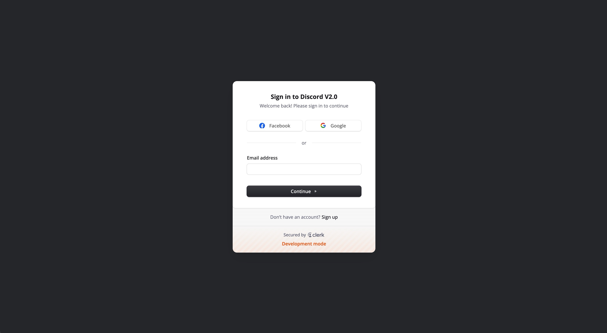
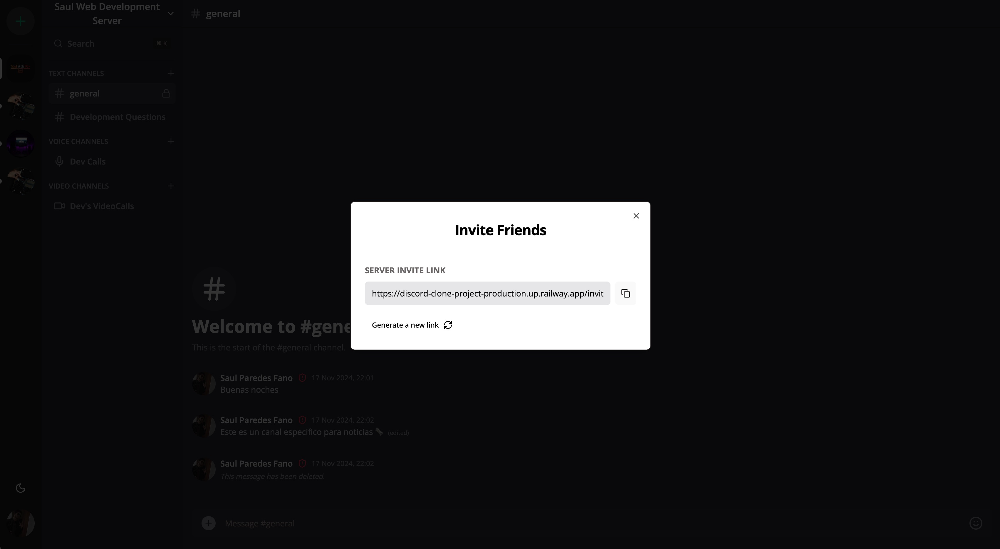
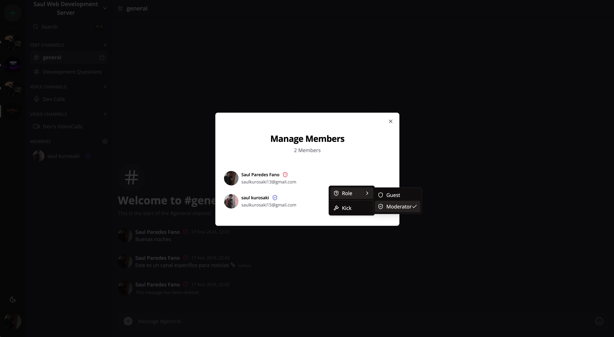
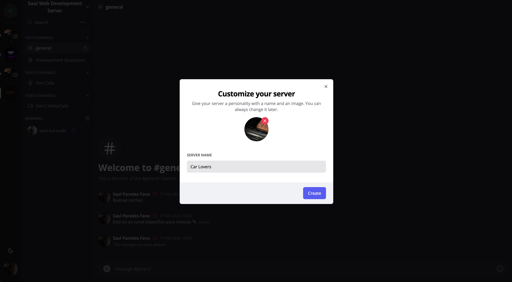
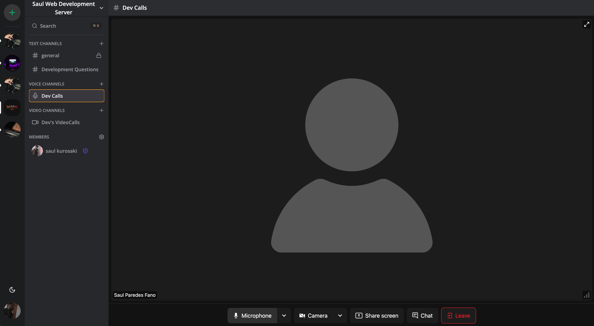
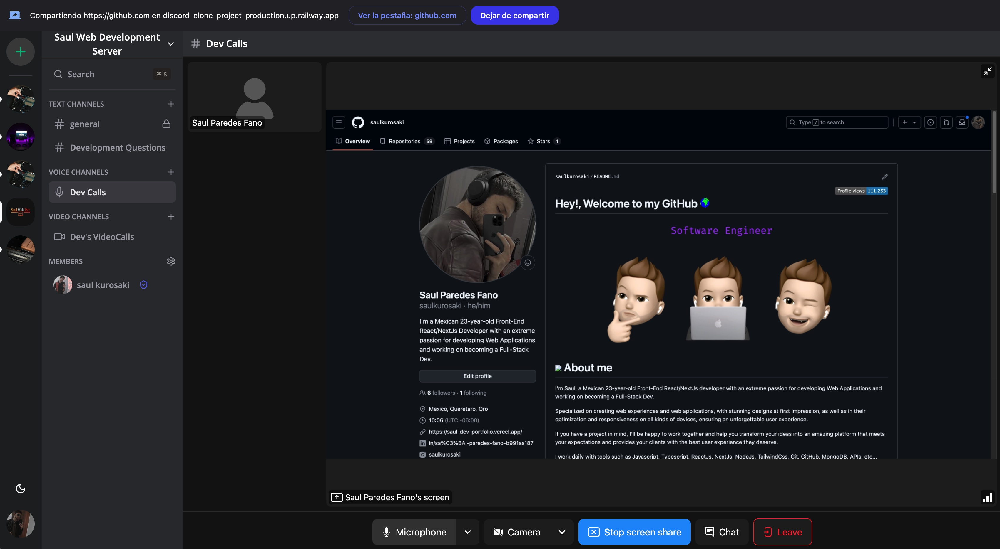
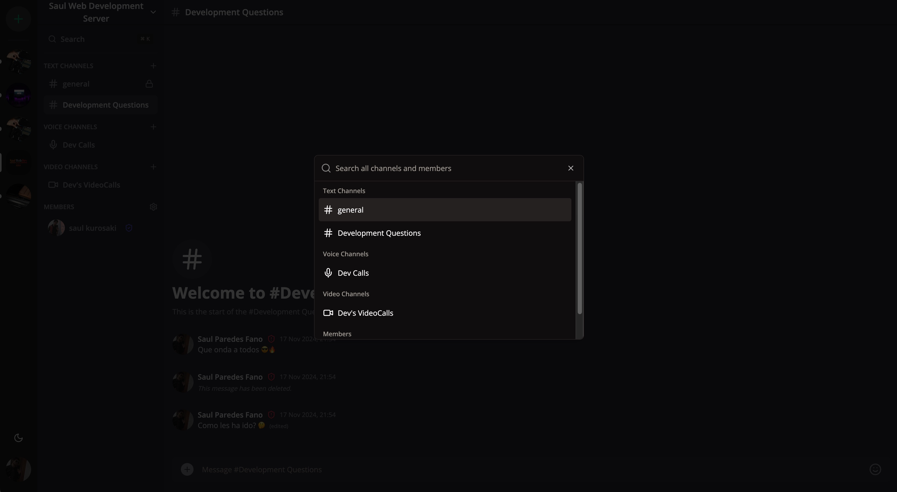
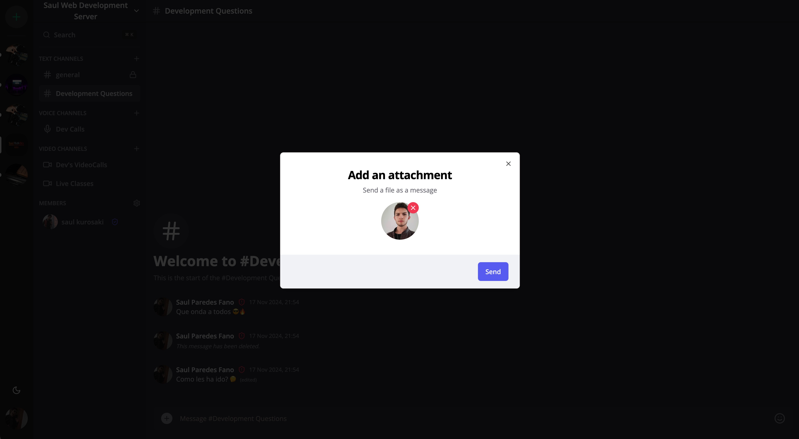

# 🚀 DISCORD CLONE: Scalable, Real-Time Community Platform

## **STRATEGIC ARCHITECTURE & BUSINESS VALUE**

### 🎯 Identified Market Problem & Value Proposition

> **Core Problem:** The challenge of building and maintaining a highly available, low-latency communication platform capable of handling real-time presence, scalable chat, and complex user permissions.
>
> **T-Shape Solution:** Engineered a robust, scalable communication platform focused on **low-latency messaging and secure user management**. This project validates the ability to architect solutions for high user concurrency and seamless real-time interaction, critical for community-driven businesses.

### 📈 Key Metrics, Anti-AI Strategy, and Business Alignment

*   **Performance Priority:** Absolute focus on **message delivery latency** and **real-time presence status**. System reliability is the core business metric.
*   **Strategy Anti-AI:** The value lies in the **architectural decision-making** regarding data partitioning, state synchronization, and secure permission handling in a complex, multi-user environment—requiring human strategic judgment.
*   **Monetization/Value Stream:** Focuses on core utility and user retention through persistent, reliable community infrastructure.

---

## **DEEP SOFTWARE ARCHITECTURE**

### 🛠️ Core Technology Stack

| Technology | Role and Strategic Justification |
| :--- | :--- |
| **Framework** | Next.js 14 (TypeScript) |
| **Backend/DB** | <Implied: Dedicated Real-Time Service like Pusher/Socket.io/Convex> |
| **Styling** | Tailwind CSS / Shadcn UI |
| **Auth** | Clerk / Custom Auth |
| **AI/Services** | Real-Time SDKs |

### ⚙️ Key Architectural Decisions

1.  **Next.js & TypeScript:** Chosen for managing complex state and concurrent user sessions, ensuring high reliability and type safety in real-time data flow.
2.  **Real-Time Service Integration:** Strategic utilization of dedicated services (if applicable) to **offload real-time infrastructure complexity**, allowing focus on Front-End responsiveness and user experience.
3.  **User Roles and Permissions:** Architecture implemented secure logic for managing **user roles and channel access**, crucial for platform governance.

---

## **T-SHAPE SUPERPOWERS & EXECUTION CHALLENGES**

### 🧠 Strategic Challenges Overcome

*   **Challenge 1:** Synchronizing real-time message delivery and user presence across various clients without performance bottlenecks.
*   **Solution 1:** Optimized subscription models and efficient data serialization/deserialization.
*   **Challenge 2:** Designing an intuitive UI/UX for a complex, nested application structure (channels, DMs, servers).
*   **Solution 2:** Leveraged **Shadcn UI** principles for a clean, accessible interface that simplifies navigation.

### 💻 Local Setup (Quick Start)

```bash
# 1. Clone the repository
git clone https://github.com/saulkurosaki/DISCORD-CLONE-PROJECT

# 2. Change directory
cd DISCORD-CLONE-PROJECT

# 3. Install dependencies
npm install

# 4. Configure variables de entorno
# Create a .env.local file and add the necessary keys for Auth (Clerk) and Real-Time Service.

# 5. Start Development Server
npm run dev
```
---















